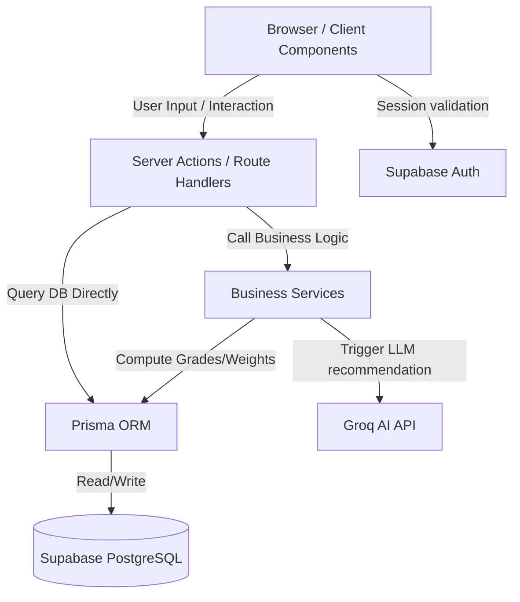

# System Architecture - Industry Mirror

Industry Mirror is a Next.js 15 application utilizing the App Router and TypeScript. The application is structured around a **Feature-based Clean Architecture** model, decoupling UI components, server-side data mutations (Server Actions), database layers (Prisma), and external service interfaces (Groq AI, Supabase).

---

## 🏛️ Architectural Overview

The application follows a modern server-oriented framework with Next.js Server Components. Here is a high-level representation of the request and data flow:

---

## 📂 Structural Boundaries

### 1. Presentation Layer (`src/app` & `src/components`)
- **`src/app`**: Implements route endpoints, layouts, and page structures. Employs Server Components by default to optimize loading and initial rendering.
- **`src/components/ui`**: Base styling tokens using Radix UI components styled with Tailwind CSS, supporting both Light and Dark modes.

### 2. Domain Feature Layer (`src/features`)
Divided by business modules (`admin`, `auth`, `landing`, `student`, `university`).
- Each feature directory isolates its layout components and server-side operations (`actions.ts`).
- Server Actions act as the primary interface between the user interface and the business logic/database.

### 3. Business Logic Layer (`src/services`)
Stateless services managing domain logic calculations:
- **`career-fit-engine.ts`**: Calculates weighted matching scores for students and matches categories (e.g. Excellent, Good, Weak).
- **`groq-career.service.ts`**: Builds templates and submits queries to Groq, converting unstructured grades into structured learning roadmap JSON.
- **`job-recommendation.service.ts`**: Resolves URL redirects for job listings on LinkedIn, JobStreet, and Glints.
- **`curriculum-ai.service.ts`**: aggregates cohort metrics to advise universities on course modifications.

### 4. Data Access Layer (`src/lib` & `prisma`)
- **`src/lib/prisma.ts`**: Houses the single prisma connection client instance used across Next.js server instances.
- **`prisma/schema.prisma`**: Single source of truth for the database design.

---

## 🧩 Architectural Decisions & Trade-offs

1. **Next.js Server Actions over REST Route Handlers**
   - *Pros*: Eliminates boilerplate code for building separate endpoints, guarantees type safety across the network boundary, and simplifies data mutation.
   - *Cons*: Difficult to consume from external non-web clients (e.g. mobile applications). Route Handlers are used as fallbacks for webhook callbacks.

2. **Zod Schema Parsing for AI JSON Responses**
   - Groq returns unstructured string text. To make it production-ready and prevent rendering errors, all Groq outputs are validated against Zod schemas in `groq-career.service.ts` before database insertion.

3. **Hybrid Auth Pattern**
   - We utilize Supabase Auth client-side for login flow triggers and registration, coupled with Server Middleware session syncs to secure routes at the edge layer.
