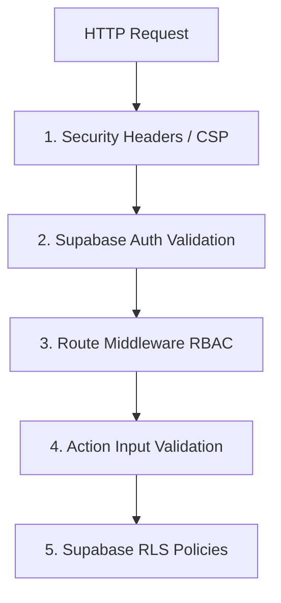

# Security Architecture & Policies - Industry Mirror

Industry Mirror incorporates industry-standard security safeguards to protect student performance metrics, university insights, and admin configurations.

---

## 🔒 Multi-Layered Security Control

---

## 🛡️ Key Protections

### 1. Row Level Security (RLS)
Every table inside the PostgreSQL database has Row Level Security enabled. This prevents direct SQL execution leaks. 
- Authenticated database transactions are bound to the current session user (`auth.user_id()`).
- Data access matches tenant boundaries (e.g. students can only view their own grades, university managers can only access analytics for their specific campus).
- Refer to [DATABASE.md](./DATABASE.md) for full RLS SQL statements.

### 2. Cross-Site Scripting (XSS) & Injection Protection
- **React Escaping**: React natively sanitizes values rendered in the Virtual DOM, rendering HTML injection inputs harmless.
- **SQL Injection**: Prisma ORM employs parameterized query binding across all database queries. Raw queries are prohibited.
- **Content Security Policy (CSP)**: Strict headers are configured in `next.config.ts` to restrict external resources. Script sources are limited to `'self'` and `'unsafe-eval'`/`'unsafe-inline'` where necessary for Next.js hydration.

### 3. Cross-Site Request Forgery (CSRF)
- Next.js Server Actions feature built-in cryptographically signed tokens.
- Secure, HTTP-only, SameSite cookies are utilized to manage authentication states.

### 4. Input Validation & Data Sanitization
- All client request inputs undergo parsing using Zod validation schemas (located in `src/validators/index.ts`) before being handled by database queries or business logic.
- Password requirements: Min 8 characters, containing uppercase, lowercase, and numeric characters.

### 5. Audit Logging (System Activity Log)
- Major platform mutations (logins, registrations, grade inserts, curriculum reports, settings updates) write historical metadata entries to the `activity_logs` table.
- Logs include action description, matching user IDs, target resources, and client metadata (IP addresses, User Agents).
